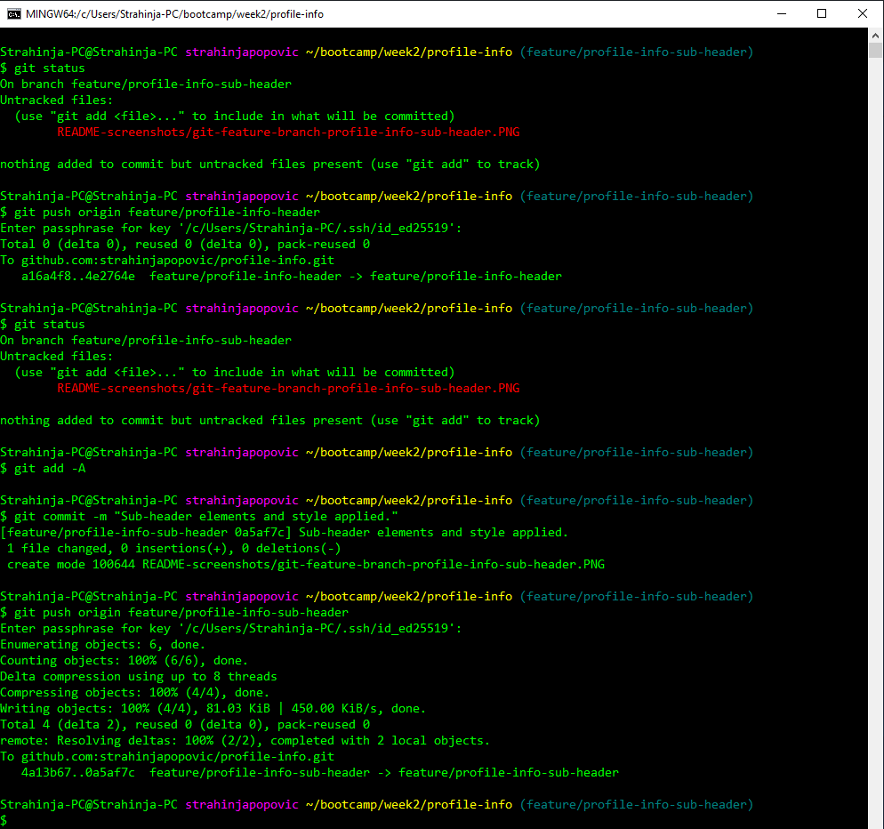

# Profile Info
## Profile Info Website

## Description

This project moving forvard with advanced HTML and CSS hendling. It involves all major partc of HTML and CSS combined together to provide best possible outcomes. HTML code is more robust and demanding with multyple layers of applied CSS with nasting coding. Also, we use Git as source code version control management system and for coolaboration. It contains notes on HTML, CSS and Git.

## Installation

N / A

## Usage

- New repository created at GitHub account strahinjapopovic as profile-info.

- Directory tree created on a local machine for lateer use.

- Clone repositories from GitHub to local HDD and assign files and folders inside repository under bootcamp/week2/profile-info local directory with additional files like index.html, style.css and directories.

- Push changes to GitHub repo profile-info (main) - main branch.

- Continuing...

- Setting up Header Elements with appropriate style into the feature branch (profile-info-header).

- Continuing...

- Sub-header section applied to the feature branch (profile-info-sub-header).

- Main section applied under feature branch (profile-info-main-section).

- Footer section applied under feature branch (profile-info-footer).

>***Each pull request PR marging the main branch and other feature branch.***

- Merging branch mian and profile-info-header.

- Merging branch mian and profile-info-sub-header.

- Merging branch mian and profile-info-main-section.

- Merging branch mian and profile-info-footer.

## Credits

N/A

## License

Please refer to the MIT LICENSE in the repo.
